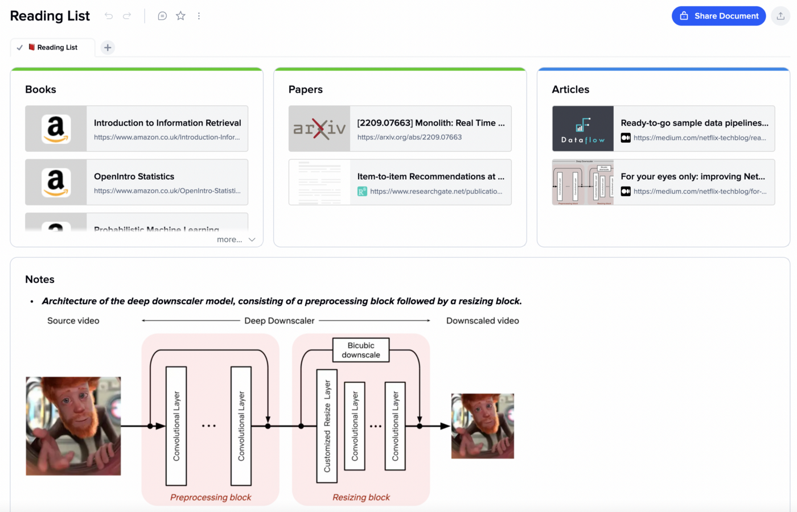
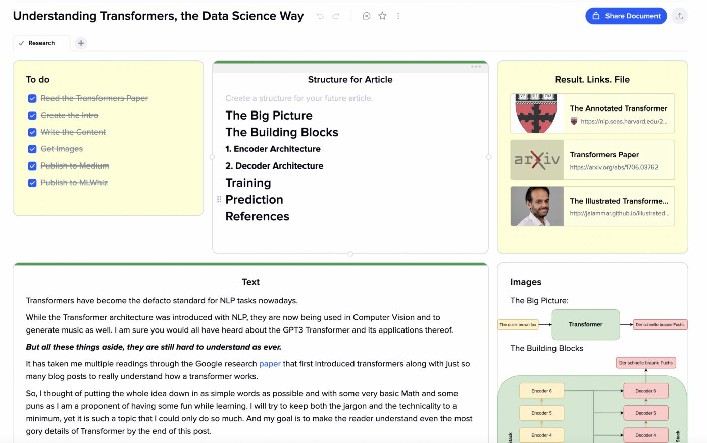
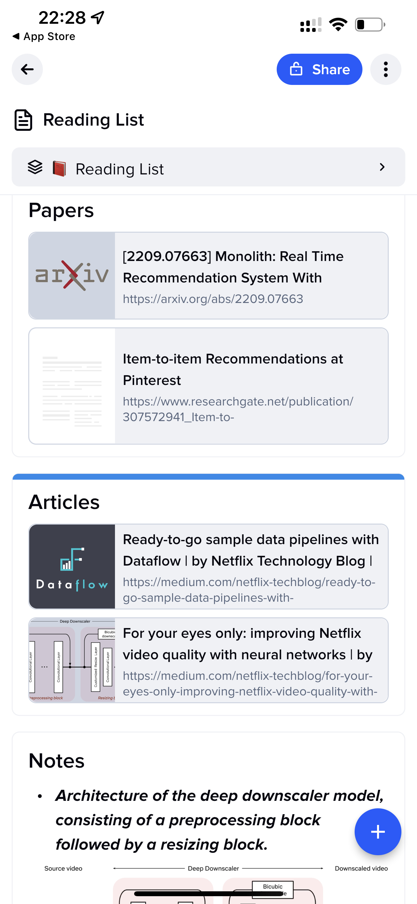
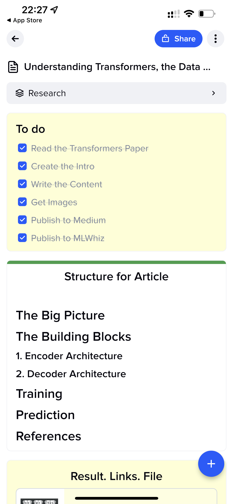
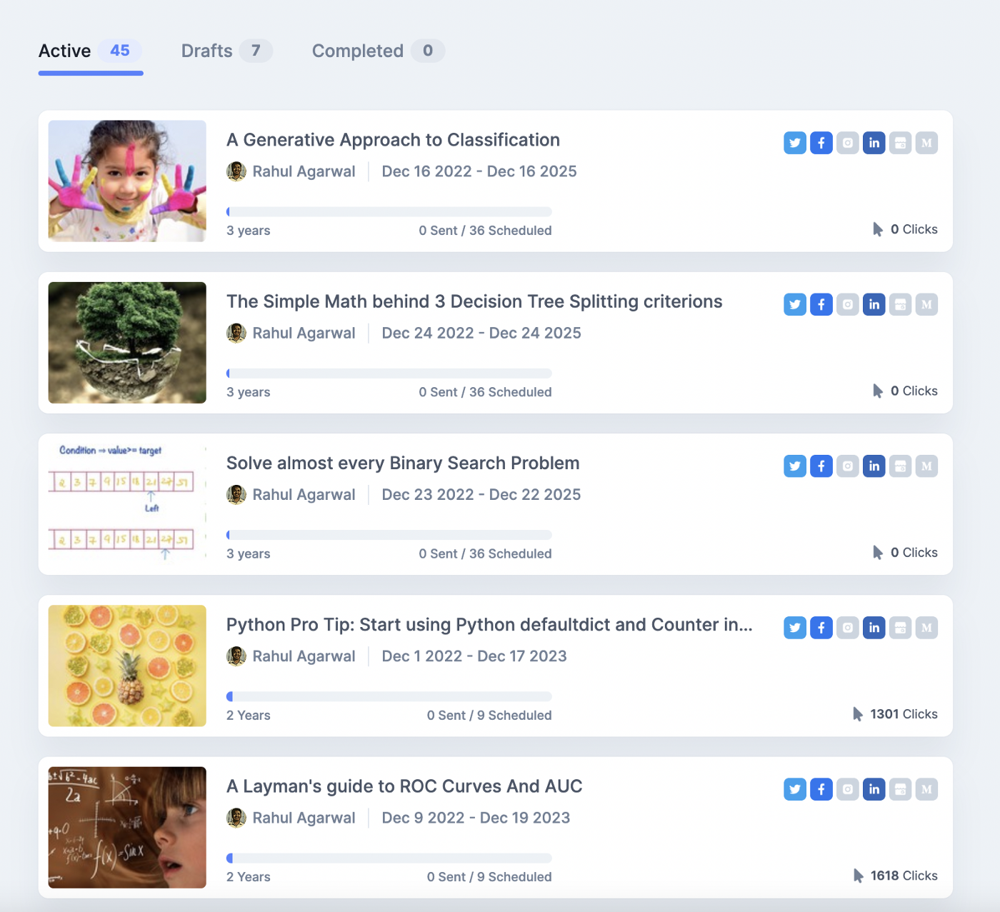
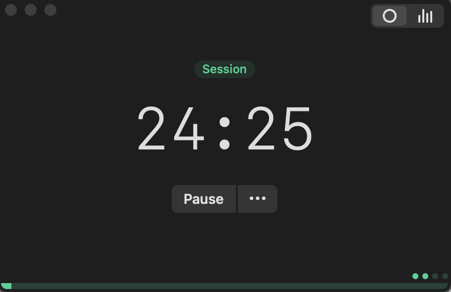

 on [Unsplash](https://unsplash.com?utm_source=medium&utm_medium=referral)](assets/da145f2e7d3b/0*98-WfAiVguSPnOcg)

Photo by [Brooke Cagle](https://unsplash.com/@brookecagle?utm_source=medium&utm_medium=referral) on [Unsplash](https://unsplash.com?utm_source=medium&utm_medium=referral)
## Unlock Your Career Potential : Learn How To Get Ahead With These 5 Simple Tips
#### Work Smarter, Not Harder \- Improve Your Productivity With These Must\-Have Workplace Tools and Tips

Are you feeling overwhelmed by your workload? Are you having difficulty completing tasks in a timely manner? We all have had this feeling somewhere in our career\. Sometimes its because we are not managing our time well\. Sometimes it is because we are not able to maintain focus\. Or sometimes its because we don’t have a clue\.

With these tips, you can learn how to boost your work productivity and get things done faster than ever\. From improving your focus to taking regular breaks, to various automation tools, these tips will help you work smarter, not harder, to achieve the results you desire\.

So, get ready to take your career to the next level and make the most of every hour\.
### 1\. Use Technology to your advantage

If you’re a millennial on the job hunt, or even if you’re in a full\-time position, you’ve probably heard that millennials are a technology\-savvy generation\. And while this is true, you don’t have to be a millennial to use technology to your advantage\. In fact, technology can help you boost your work productivity and get things done faster than ever\.

I have made it a habit to be on a constant lookout for tools that I can use to boost my productivity\. Here are a few examples from my day to day:
- [**XTiles**](https://xtiles.app?lmref=04tTkA) **App:** This awesome [app](https://xtiles.app?lmref=04tTkA) is what I use to take meeting notes, organize my reading schedule, and for researching and taskifying my blog posts\. I love writing in Markdown and I have made it a habit to take notes from my meetings using this app\. Jotting things and thoughts down here always helps me to reiterate what has happened and to organize my thoughts more clearly\. I could combine different types of information video, photo, text, links in a pretty visual way\. Here are a few ways in which I have been using this app:

Working with Xtiles App to Keep tabs on my Reading \(Left\) and writing a Blogpost\(Right\)

This works well on iPhone as well\. This really helps me to organize my thoughts, read up papers and write on the go\. It also provides the functionality to export the docs as PDF, or Markdown which has been very useful while creating content\. It has been so amazingly helpful that I have got a [lifetime plan](https://xtiles.app?lmref=04tTkA) for the same now\.

Author Image: Working on my projects on the App to organize my thoughts, read up papers and write on the go
- **Tasks App:** I use [Microsoft Todo](https://todo.microsoft.com/tasks/\) to list out and arrange my tasks into logical groups rather than the Mac Notes app I see a lot of people using\. The advantage of this approach is that this app is my one stop destination whenever I feel I need to find something to work on\. Or to prioritize my day\.
- In my org, we use Slack\. I have now started using Slackbots to setup reminders, communicate with Jira tasks, create Zoom meetings and so on\.

These are just few of the examples which work well for me\. All of these tools play a part in helping me plan and manage my time wisely\. For you these apps might be different but the main point here is to use and invest time to learn the technology at your disposal\.
### 2\. Find your Groove

While I am talking about the time management part, I would like to emphasize another simple rule that works well for me\. And this particular rule is specific to one self\.

So for myself, I have noticed that when I know what to do when I get up, my day is much more productive than if I were to make a plan for the day in the morning\. This is because I am inherently a night person and I don’t perform that well in mornings \(Or until I have a Coffee\) \. So, now I have made it a habit to plan my next day in advance when I am in the bed sleeping\.

This particular rule serves two purposes for me — Puts me to sleep and I have an action plan when I get up\. That is where I am opposed to the conventional wisdom of waking early\. Sure it works for a lot of people but **_you do what works the best for you_** \.

As you work, you would notice that there are certain things that work well for you too\. Experiment and find those out and then make it a point to stick to them\.
### 3\. Try to Automate Stuff

When you Automate recurring stuff you leave time for yourself to engage in more fruitful activities\. I normally try to find things that are repetitive and think for ways to automate that stuff\. This might involve using tools, writing code or delegating stuff\.

For Example: In my first job at Fractal, I remember many teams were doing reporting analytics which involved pulling data from [SQL](https://towardsdatascience.com/learning-sql-the-hard-way-4173f11b26f1) , working on SQL data with MS\-Access, massaging the data with excel and then finally putting this data in a Spotfire dashboard\. Used to take 2–3 days to do all this\. And it was incredibly wasteful\. Didn’t take me long to realize that this could all be probably be done using [SQL](https://towardsdatascience.com/learning-sql-the-hard-way-4173f11b26f1) \.

So I just used [SQL](https://towardsdatascience.com/learning-sql-the-hard-way-4173f11b26f1) , and reduced the process time to 4 hours\. This left me a lot of time which I spent gaining mastery over Foosball\. But jokes apart, this whole thing saved the company a lot of personhours as there were multiple projects being done in the same way\.

Another example, just a few days back, I found myself accessing a few queries on a daily basis to monitor a system\. Why not create a dashboard using [Plotly](https://mlwhiz.com/blog/2019/05/05/plotly_express/?utm_campaign=shareaholic&utm_medium=reddit&utm_source=news) or [Streamlit](https://towardsdatascience.com/how-to-write-web-apps-using-simple-python-for-data-scientists-a227a1a01582) with those queries? Would help me as well as other people who can see the data in a much nicer fashion\.

Or, one another example being [Missinglettr](https://lttr.ai/5eha) , which I use to reshare my [blog](http://mlwhiz.com) on social platforms automatically\. Here is a [50% off link](https://lttr.ai/5eha) for 3 months for the same if you would like to use it for improving your social presence\.

Author Image: My Missinglettr Dashboard

There are a lot of other tools you could use to automate stuff\. Or you could create one yourself using [Python](https://mlwhiz.gumroad.com/l/advanced_python_tips) — Selenium, BeautifulSoup and pyppeteer\.
### 4\. Take regular breaks

Staying productive in the workplace can be challenging\. We all face moments of fatigue, distraction, and procrastination\. Why not have that one cup of tea? One way to stay focussed and productive is to use the Pomodoro Technique\. I use this technique religiously and haev made it a point to have atleast 5 Pomodoro sessions throughout the day atleast\.

But what is this Pomodoro technique? Pomodoro technique is just a fancy word, which means tomato, that promotes taking regular breaks throughout the day, which can help break up the monotony of work and keep your productivity levels high\.

Author Image: Tomito Pomodoro Timer

Tell me More? Actually its not about just taking breaks\. The Pomodoro Technique works by breaking down tasks into 25\-minute intervals separated by short 5\-minute breaks\. During these 25 minutes, you focus on one single task without distractions\. After each interval, you take a short break for 5 minutes before resuming work on the same task or moving on to the next one\. By using this technique, you will be able to increase your productivity levels as it focuses your attention on one single task during the 25\-minute intervals so that you can complete it faster than if you were distracted by multiple tasks at once\.

Additionally, taking regular breaks throughout the day helps to re\-energize so that you don’t get too exhausted while working\. I use the very simple MacOS app: [Tomito](https://tomito.app/) to track my time and organize my sessions\. You can also try out the Pomodoro Technique today and see how it increases your productivity\!
### 5\. Smile while you work

 on [Unsplash](https://unsplash.com?utm_source=medium&utm_medium=referral)](assets/da145f2e7d3b/0*UZNq80GcZm00qHx9)

Photo by [Surface](https://unsplash.com/@surface?utm_source=medium&utm_medium=referral) on [Unsplash](https://unsplash.com?utm_source=medium&utm_medium=referral)

> “A smile is a curve that sets everything straight\.” — Phyllis Diller 

When I was preparing for my IIT competitive exams, I got this gem of a tip from my senior\. Actually, I read it in their interview\. And I made it my mantra while preparing for the exams\. This tip has worked wonders for me throughout my preparation and even now\. “Smiling while working” not only boosts one’s mood but can also help increase productivity\.

Research has shown that smiling can reduce stress levels by releasing endorphins which lead to better focus and higher energy levels\. Smiling also increases our self\-confidence, leading to increased creativity and improved problem\-solving abilities\. Furthermore, smiling helps to create stronger relationships with colleagues which is key for successful teamwork and achieving common goals\.

So next time you’re stuck on a task or feeling overwhelmed, take a few moments to smile, it just might make all the difference\!

I hope that these tips will help you boost your work productivity and get things done faster than ever\. Now, all you have to do is put them into practice and reap the benefits\.
### Continue Learning

Yes\! There is a course for that: [Work Smarter, Not Harder: Time Management for Personal & Professional Productivity](https://imp.i384100.net/GjzVy2) from the University of California, Irvine\. Do check it out\.

I am going to be writing more helpful posts in the future too\. Follow me up at [**Medium**](https://medium.com/@rahul_agarwal) or Subscribe to my [**blog**](https://mlwhiz.ck.page/a9b8bda70c) to be informed about them\. As always, I welcome feedback and constructive criticism and can be reached on Twitter [@mlwhiz](https://twitter.com/MLWhiz) \.

Also, a small disclaimer — There might be some affiliate links in this post to relevant resources, as sharing knowledge is never a bad idea\.

_Converted [Medium Post](https://medium.com/@mlwhiz/unlock-your-career-potential-learn-how-to-get-ahead-with-these-5-simple-tips-da145f2e7d3b) by [ZMediumToMarkdown](https://github.com/ZhgChgLi/ZMediumToMarkdown)._
